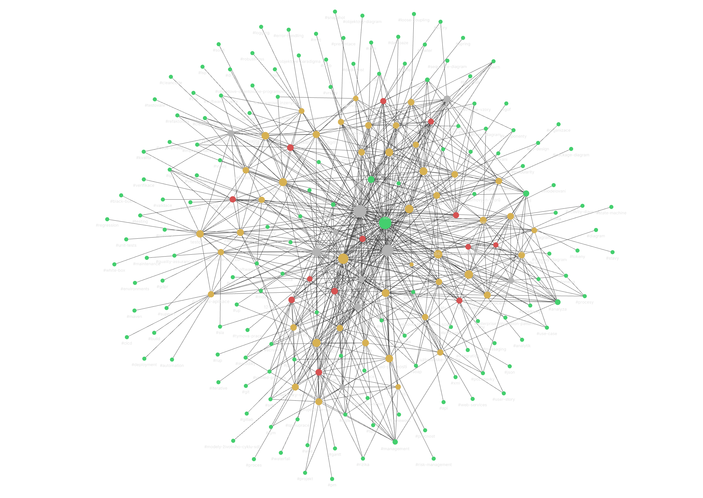

# BI-SWI Wiki (Softwarové inženýrství)

Tento repozitář obsahuje znalostní bázi pro předmět **BI-SWI (Softwarové inženýrství)** na FIT ČVUT. Projekt byl vytvořen jako studijní materiál, který syntetizuje poznatky z přednášek, seminářů a doplňkové odborné literatury do přehledné a vzájemně provázané formy.

Renderovaná verze wiki je dostupná na **[GitHub Pages](https://dzendys.github.io/swi_wiki/)**.

## Jak s wiki pracovat
- **Vyhledávání**
  
  V online verzi lze použít vyhledávací pole pro rychlý přístup ke všem pojmům.

- **Křížové odkazy**
  
  Témata jsou vzájemně propojena, což umožňuje sledovat souvislosti napříč celým předmětem (např. od požadavků k jejich modelování a následné verifikaci).

- **Příprava na zkoušku**
  
  Pro ucelené pochopení látky se doporučuje kombinovat studium chronologických přednášek s tematicky zaměřenými koncepty a teoretickými otázky.

## Obsah wiki

Obsah je rozdělen do dvou hlavních částí pro usnadnění orientace v látce:

### 1. Teoretické koncepty
Detailně zpracovaná témata pokrývající klíčové oblasti softwarového inženýrství:
- **Základy**
  
  Softwarové inženýrství, Objektové paradigma, Clean code, Refaktoring.

- **Analýza a požadavky**
  
  Požadavky, Případy užití, Uživatelské příběhy, Role analytika.

- **Modelování (UML)**
  
  Doménový model, Diagram tříd, Diagram případů užití, Diagram aktivit, Stavový diagram, Sekvenční diagram, Objektový diagram, Diagram balíčků.

- **Architektura a návrh**
  
  Softwarová architektura, Vrstvy architektury, Komponenty a rozhraní, Návrhové vzory GoF, MVC a MVP, Dependency injection.

- **Persistence a data**
  
  Persistence dat, Mapování dědičnosti.

- **Procesy a metodiky**
  
  Metodiky vývoje, Agilní vývoj, Scrum, Unified Process, Obchodní procesy.

- **Kvalita a verifikace**
  
  Zajištění kvality, Testování, Verifikace a validace, Ošetření chyb a logování.

- **Management a provoz**
  
  Projektové řízení, Řízení rizik, Odhad pracnosti, Týmová spolupráce, Nasazení aplikace, Podpora a údržba, Integrace aplikací, Webové služby (REST, SOAP).

### 2. Průvodce přednáškami
Chronologický přehled kurzu. Stránky shrnují klíčové body jednotlivých přednášek a odkazují na detailní zpracování souvisejících konceptů.

---
*Vytvořeno jako podpora pro studium předmětu BI-SWI na FIT ČVUT.*
